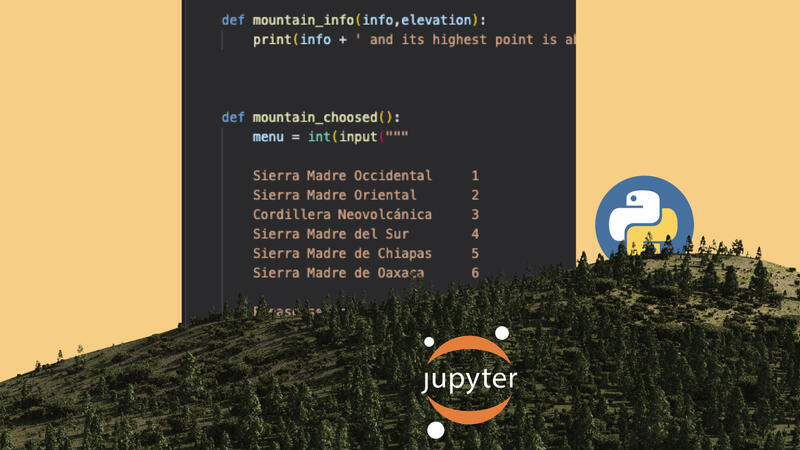

# Notes of Python

- This is a personal project to share my notes about Python programming language.

- Python version ```Python 3.10.0 ```

## Scope
- The content is in Spanish language

## Installation
Use the package manager *pip* to install *jupyter notebooks*
```bash
pip install jupyter
```

## Roadmap
* [Python Basic Notes](https://github.com/r3card0/Python-Notes/blob/main/PythonBasic/00_Python_Basico.md)
* [Python Intermediate Notes](https://github.com/r3card0/Python-Notes/blob/main/PythonIntermediate/00_Python_Intermedio.md)
* [Python Advanced Notes](https://github.com/r3card0/Python-Notes/blob/main/PythonProfessional/00_Python_Avanzado.md)
* [Projects](https://github.com/r3card0/Python-Notes/blob/main/Projects/Projects.md)


## Project Status
- In progress


